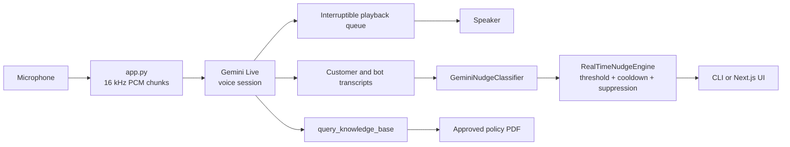

# Native Voice Bot — Assessment Deliverable

This repository contains a live voice-bot assessment prototype for retail
banking loan qualification. It demonstrates real-time audio streaming,
multilingual transcript classification, grounded policy lookup, actionable
nudges, interruption handling, and measurable latency reporting.

## Deliverables map

| Requirement | Evidence |
|---|---|
| Repository and setup | This README, `requirements.txt`, `.env.example` |
| Streaming method | `app.py` microphone loop and Gemini Live session |
| Browser UI | `next-ui/` and its `/api/call` bridge |
| Signal design | `llm_nudges.py`, `nudge_engine.py` |
| Nudge logic | Confidence threshold, source rules, cooldown and expiry |
| Latency report | `app.py` shutdown report with P50/P95 values |
| False-positive controls | Conservative `NONE`, confidence threshold, usable-text filter, cooldown and duplicate suppression |
| Compliance example | Unsupported guarantee → `COMPLIANCE_RISK` nudge |
| Missed-opportunity example | Second vehicle/asset need → `MISSED_CROSS_SELL` nudge |
| Tests | `test_assessment.py`, `test_interruption.py`, `test_nudge_engine.py`, `test_knowledge_base.py` |

Recorded calls and video walkthroughs must be captured separately for final
submission. Do not commit customer recordings or personal information.

## Architecture



## Clone and setup

After cloning, create the environment and provide your own Gemini key. No API
key is included in this repository:

```powershell
python -m venv venv
.\venv\Scripts\python.exe -m pip install -r requirements.txt
Copy-Item .env.example .env
# Edit .env and add your own GEMINI_API_KEY locally
```

### CLI call

```powershell
.\venv\Scripts\python.exe app.py india
```

Supported markets are `india`, `philippines`, and `indonesia`. All three use
the retail banking loan-qualification use case, with Hinglish, Taglish, and
Bahasa Indonesia conversation styles respectively.

### Next.js UI

```powershell
cd next-ui
npm.cmd install
npm.cmd run dev
```

Open `http://localhost:3000`. The browser UI starts the Python engine, polls
transcript/nudge events, and provides Start/Stop controls. The Python engine
uses the computer's default microphone and speaker, so both processes should
run on the same machine. Use headphones when testing interruption.

## Streaming and interruption method

- Microphone audio is sent as 16 kHz mono PCM in 100 ms input chunks.
- Gemini Live returns streamed audio and transcription events.
- Output audio is kept in a thread-safe queue with 20 ms playback callbacks.
- Sustained local speech clears queued/partial bot audio.
- Gemini's `interrupted` event also clears playback.
- New model audio is accepted after the interrupted turn completes.

## Signal design and nudge logic

The classifier returns one JSON signal and confidence score:

- `MISSED_CROSS_SELL`: clear additional asset/product need.
- `RISING_FRUSTRATION`: explicit dissatisfaction or human request.
- `PAYMENT_DIFFICULTY`: inability to afford or cost objection.
- `COMPLIANCE_GAP`: fees/rates/terms requested before verified disclosure.
- `COMPLIANCE_RISK`: unsupported guarantee or unsafe agent claim.
- `CALLBACK_REQUEST`: explicit request for a later call.
- `DISCLOSURE_GIVEN`: verified material disclosure from the agent.

The engine suppresses alerts when text is too short/noisy, confidence is below
`0.78`, the same signal is inside its 12-second cooldown, the exact text
fingerprint recently fired, or a compliance disclosure has already been given.
Nudges expire after 45 seconds. Agent speech can only produce compliance risk;
customer speech cannot produce compliance risk or disclosure signals.

## Required demonstration cases

### Compliance example

Agent says: “Approval is guaranteed with no documents.”

Expected result: `COMPLIANCE_RISK` with a high-priority correction nudge.

### Missed-opportunity example

Customer says: “I am buying another vehicle for my family.”

Expected result: `MISSED_CROSS_SELL` with a recommendation to ask about the
second asset without quoting an unverified offer.

Other useful calls:

```text
“The EMI is more than I can afford.”
“I am frustrated. Please let me speak to a person.”
“What are the fees and interest charges?”
```

## Latency and test evidence

At shutdown, the CLI prints a JSON latency report with counts and P50/P95 for
the measured ASR estimate, signal extraction, LLM classification, nudge
delivery, and audio-to-nudge estimate. ASR and audio-to-nudge timestamps are
utterance-start estimates because the API does not align each transcript update
to an exact input chunk.

Run deterministic tests:

```powershell
.\venv\Scripts\python.exe -m unittest -v test_assessment.py test_interruption.py test_nudge_engine.py test_knowledge_base.py
```

`test_assessment.py` is fully offline and demonstrates the required compliance,
missed-opportunity, and low-value suppression cases. `smoke_live.py` and
`smoke_nudges.py` are optional live checks and require the user's own
`GEMINI_API_KEY`; `smoke_nudges.py` consumes API quota.

The live classifier check consumes Gemini API calls:

```powershell
.\venv\Scripts\python.exe smoke_nudges.py
```

## Known limitations

- The bundled policy source is an India PDF only. Philippines and Indonesia
  need approved local policy documents before quoting local facts.
- The PDF has a conflicting minimum-loan value; the bot will not quote it until
  a policy owner resolves the conflict.
- Free-tier Gemini quotas can pause nudge classification while voice playback
  and interruption continue.
- The prototype uses one local microphone/speaker session and in-memory state.
- No telephony transfer, callback scheduler, CRM write, authentication,
  authorization, or persistent audit store is included.
- No speaker diarization is available; separate input/output streams define
  customer and agent roles.
- Noisy audio can delay or prevent ASR. Production needs noise suppression,
  device selection, audio quality monitoring, and stronger interruption tuning.

## 10x scale limitations and production improvement plan

At 10x concurrent calls, local PyAudio, per-process model loading, in-memory
queues, synchronous PDF embedding initialization, and per-transcript Gemini
requests would create CPU, memory, quota, and latency bottlenecks. Production
should use managed audio gateways, isolated session workers, an autoscaled
queue, a shared vector store with precomputed embeddings, model rate limiting
and backoff, circuit breakers, structured logs/metrics/traces, redacted event
storage, tenant isolation, and regional policy versioning.
